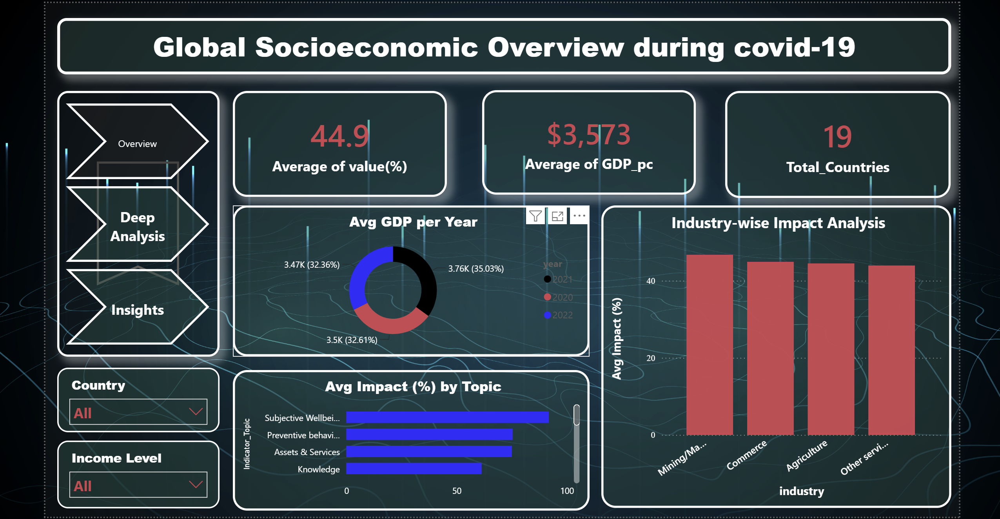
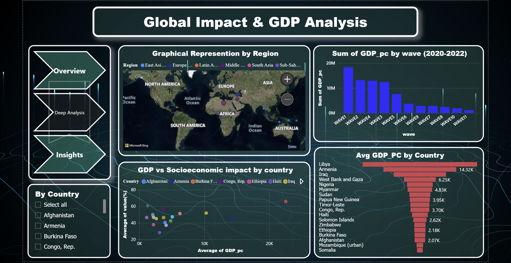
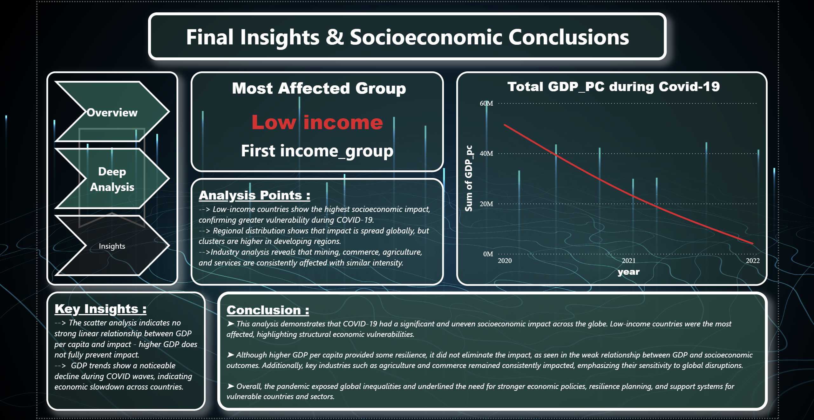

# Global Socioeconomic Impact Analysis during COVID-19

An interactive Power BI project analyzing the global socioeconomic impact of COVID-19 using data cleaning, transformation, analysis, and visualization.

## 📊 Project Overview

This project uses Microsoft Excel and Power BI to analyze socioeconomic data across countries, regions, income groups, industries, and indicator topics.

The project follows an ETL workflow:

Raw Dataset → Data Cleaning → Cleaned Dataset → Power BI Dashboard → Analysis & Insights

## 🗂️ Dataset

### Raw Dataset

The original dataset before data cleaning and transformation.

📁 `data/raw/raw_data.xlsx`

### Cleaned Dataset

The dataset after cleaning and preparation for analysis.

📁 `data/cleaned/cleaned_data.xlsx`

## 📈 Power BI Dashboard

The interactive dashboard includes:

- KPI analysis
- Country-wise GDP analysis
- GDP vs socioeconomic impact
- Year-wise GDP analysis
- Regional analysis
- Income group analysis
- Topic-wise impact analysis
- Industry-wise impact analysis
- Interactive filters and slicers

📁 `dashboard/Visualizationpjt.pbix`

## 🖼️ Dashboard Preview

### Overview

### Global Impact & GDP Analysis

### Final Insights

## 🔄 ETL Process

### 1. Extract
The raw dataset is collected and imported for analysis.

### 2. Transform
The data is cleaned and prepared by handling missing values, removing unnecessary data, standardizing formats, and preparing the required fields.

### 3. Load
The cleaned dataset is loaded into Power BI to create visualizations, KPIs, filters, and interactive dashboard pages.

## 🔍 Analysis Performed

- Country-wise analysis
- Income group analysis
- GDP analysis
- GDP vs socioeconomic impact
- Year-wise analysis
- Topic-wise impact analysis
- Industry-wise impact analysis
- Regional analysis
- Wave-wise analysis
- Interactive dashboard analysis

## 🛠️ Tools & Technologies

- Microsoft Excel
- Microsoft Power BI
- Power Query
- Data Cleaning
- Data Transformation
- Data Visualization
- Exploratory Data Analysis

## 📄 Project Report

The complete project report is available here:

📁 `final_report/final_report.docx`

## 🚀 Future Scope

- Real-time data integration
- Predictive analytics
- Automated data processing
- Additional socioeconomic variables
- Web-based dashboard
- Advanced data visualization
- Mobile-friendly dashboard

## 👨‍💻 Author

**Mahammad Lathif Ahamad**

B.Tech CSE  
Lovely Professional University
